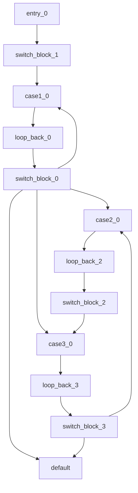

## 打破大模型迷信
最近几个月我一直在尝试使用大模型对二进制文件进行自动去混淆，结果完全是灾难性的，我不得不推倒重来。我意识到我陷入了一种大模型迷信，就像以前的研究迷信神经网络一样，“只要把数据扔进去，只要训练，一切都会好起来的”。

但是，大模型在专业领域上完全无法应对困难的需求。来看看我从重到轻的信赖吧：

**1.**我尝试直接将汇编代码、IR代码、反编译得到的伪C代码输入大模型，要求直接生成去混淆代码。从结果上看，大模型似乎读懂了代码的大致含义，却将去混淆更多地视为一种“代码翻译”任务，也即基于自身对代码主体功能的理解自行编写代码从而实现相同功能。而在自行编写的代码中充斥着各种原本代码中不存在的语句、功能乃至语句顺序前后颠倒，字符串任意改写等等问题。
这自然是不能接受的。

**2.**为了抵抗幻觉，确保代码前后的一致性。我尝试使用Agent方案，通过自定义代码修改工具+大模型主动调用的方式去混淆。结果更为灾难，鉴于C语言语法过于丰富，我从LLVM IR层级实现了一系列控制流操纵工具。然而，即使大模型理解了IR代码，意识到其中可能存在控制流平坦化这样的混淆技术，他仍然无法利用这些工具实现去混淆，通过不断地拆分删除，大模型最终迷失在了面目全非的修改后代码中。我希望“他生成去混淆决策，我实现去混淆步骤”的方案失败了。

**3.**既然如此，那让我来生成决策，我来实现步骤，而大模型只需要提供他最擅长的总结性信息呢？在控制流去混淆中，最困难的就是不知道如何优化，不知道数据的真实流向，不知道什么样的行为叫做混淆。于是我以`程序执行实际生效的路径数/控制流图展示的所有路径数`作为去混淆优化的最终目标。在解决了“带循环的控制流图存在无限路径”这些问题后，如何统计程序执行实际生效的路径呢？我将之托付给了大模型。
在尝试了正则表达式、自动状态机、zero-shot、one-shot等方案后，来看一个简单的提问：
````
对于给定的一段IR函数，请从数据流分析的角度分析程序在实际执行过程中的控制流，表达为mermaid格式。注意同一基本块在不同数据流下可能做出不同行为在图中应该对应不同图节点，这里我首先给出一个简单示例：
define i64 @main(i64 %argc, i8** %argv){
entry:
  %stack_var = alloca i32
  store i32 -2108010136, i32* %stack_var
  br label %switch_block

switch_block:
  switch i32 %stack_var, label %default [
    i32 -2108010136, label %case1
    i32 -730291163, label %case2
    i32 -182715412, label %case3
  ]

case1:
  %1 = call i32 @somefunction()
  store i32 %1, i32* %stack_var
  br label %loop_back

case2:
  store i32 -182715412, i32* %stack_var
  br label %loop_back

case3:
  %2 = call i32 @somefunction()
  %3 = select i1 %2, i32 1394467365, i32 -730291163
  store i32 %3, i32* %stack_var
  br label %loop_back

loop_back:
  br label %switch_block

default:
  ret i64 0
}
它对应的mermaid图为

这里基本块switch_block因为在数据流中%stack_var的不同表现出了不同行为，因此在图中以switch_block_0、switch_block_1、switch_block_2、switch_block_3等多种形式出现。其中switch_block_0代表不带任何额外约束或约束条件不确定的情况，此时switch_block_0的后继选择等同于不带数据流分析的控制流图情况。switch_block_1、switch_block_2、switch_block_3则分别代表确定的不同约束条件下的情况。loop_back块因为后续switch_block块的拆分而对应拆分，从而避免控制流混淆。
````

到了这一步，我分配给大模型的任务已经与代码优化脱钩了，相反更像是符号执行（另外一嘴，我尝试使用angr对任意函数进行符号执行与实际控制流的统计，但或许是在此之前没有积累的原因，我无法成功让angr找到可行的路径），那么大模型的表现如何呢？

失败了，大模型正确理解了我的意图，却生成了错误的mermaid自动状态机，混淆过后过于复杂的代码结构将大模型的回答完全摧毁了。

***不要将大模型当作一个人，并报有过高的期许。***
